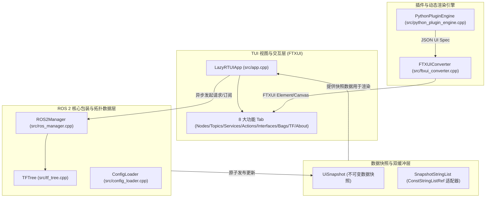
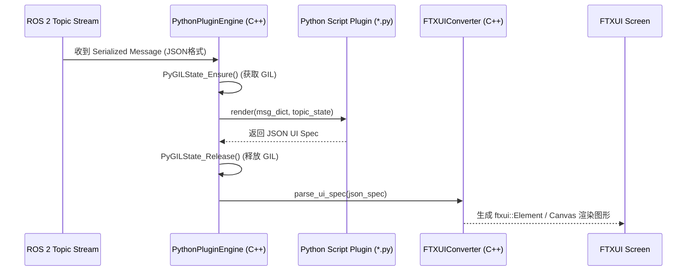

# LazyRTUI - C++ FTXUI 架构设计与开发规范指南 (DESIGN.md)

> **目标定位**：LazyRTUI 是一款专为 ROS 2 环境打造的轻量级、高响应性、零日志污染 (Zero `~/.ros/log` Spam) 的终端用户界面 (TUI) 诊断与交互工具。
> 
> 本文档为 `lazyrtui` 项目的**唯一权威设计与开发标准**。后续所有功能迭代、模块重构与代码编写均必须严格遵循本文档所定义的架构规范、接口定义与数据流设计。

---

## 1. 核心设计理念与约束

### 1.1 核心设计理念
1. **键盘优先 (Keyboard-First Navigation)**：面向无图形界面 (Headless) 或 SSH 远程终端环境，全界面支持全键盘快捷导航与 Vim 式 (`j`/`k`) 滚动控制。
2. **零日志污染 (Clean ROS 2 Lifecycle)**：应用生命周期内仅维持**单一持久化 ROS 2 节点 (`lazy_rtui_node`)**，禁用任何通过子进程产生临时节点 (`ros2 cli`) 污染 `~/.ros/log` 的行为。
3. **60 FPS 无锁双缓冲渲染 (Lock-Free Double-Buffered Rendering)**：FTXUI 的 `Render()` 主线程与后台 ROS2 图查询/消息接收解耦，UI 视图仅读取不可变快照 (`UiSnapshot`)，保证渲染零卡顿。
4. **IDL 驱动的插件渲染系统 (IDL-Driven Plugin Engine)**：以 ROS 2 Message/Service/Action IDL (JSON 转换格式) 作为基准输入，支持 Python 扩展插件处理消息并输出 JSON UI 描述符，由 C++ 引擎实时绘制终端图表与动态控件。

### 1.2 强制性技术约束 (Hard Engineering Rules)
- **C++ 标准**：完全遵循 **C++17** 标准。
- **命名空间**：所有项目代码统一包含在 `namespace lazyrtui { ... }` 作用域内。
- **第三方依赖管理**：所有非 ROS 2 的第三方 C++ 依赖库必须存放在 `third_party/` 目录中作为 **Git Submodules**，且带明确的版本后缀（例如 `third_party/FTXUI_v7.0.3`）。**严禁**在 `CMakeLists.txt` 中使用 `FetchContent`。
- **头文件包含规范**：FTXUI 头文件统一引入 `<ftxui/component/component.hpp>` 与 `<ftxui/component/screen_interactive.hpp>`，严禁前置声明 `ftxui::ScreenInteractive`（FTXUI v7+ 中其为类型别名）。
- **线程安全与 Python GIL**：所有 ROS 2 回调与后台线程必须通过 `std::mutex` 保护数据；涉及嵌入式 Python C API 的调用必须显式使用 `PyGILState_Ensure()` 与 `PyGILState_Release()` 进行 GIL 锁保护。

---

## 2. 系统整体分层架构

LazyRTUI 采用高度解耦的四层架构设计：



### 架构组件说明

1. **TUI 视图与交互层 (`LazyRTUIApp`)**
   - 负责 FTXUI `ScreenInteractive` 主循环管理、顶部 Header / 底部 Footer 渲染、全局按键捕捉 (`CatchEvent`) 与 Modal 弹窗。
   - 维护 8 个 Tab 面板的激活焦点 (`0=Left Pane, 1=Right Pane`) 与切换逻辑。
2. **数据快照与双缓冲层 (`UiSnapshot` & `SnapshotStringList`)**
   - 实现 UI 渲染与 ROS 后台线程的完全解耦。
   - 后台线程修改工作数据缓冲区，触发快照发布 (`std::atomic_store`)；UI 线程在 `Render()` 时通过 `std::atomic_load` 无锁读取只读快照。
3. **插件与动态渲染引擎 (`PythonPluginEngine` & `FTXUIConverter`)**
   - **`PythonPluginEngine`**：加载 `./plugins/*.py` 插件脚本，匹配 topic/msg_type，在 GIL 保护下将 ROS 消息转换为 Python 字典，调用 `render(msg, state)` 并获取 JSON UI Spec。
   - **`FTXUIConverter`**：将 JSON UI 描述符解析为 FTXUI 的 `Element` / `Decorator` / `Canvas`（终端 ASCII 折线图/仪表盘）。
4. **ROS 2 核心包装与拓扑数据层 (`ROS2Manager` & `TFTree`)**
   - 使用 **PIMPL 模式** (`ROS2Manager::Impl`) 隐藏 `rclcpp` 头文件包含。
   - 维持单例 `rclcpp::Node` 后台 `spin_loop` 线程。
   - 提供节点、话题、服务、动作拓扑查询；使用 `GenericSubscription` 进行动态消息监听；使用原生 `rclcpp::GenericClient` / C++ 接口发起 Service / Action 调用。
   - 监听 `/tf` 和 `/tf_static` 维护实时坐标变换树 `TFTree`。

---

## 3. 核心子系统详细设计

### 3.1 ROS 2 拓扑管理与通信层 (`ROS2Manager`)

#### 3.1.1 节点生命周期与线程模型
- 在 `ROS2Manager::start(argc, argv)` 中初始化 `rclcpp::init`，创建 `lazy_rtui_node` 节点与 `SingleThreadedExecutor`。
- 启动后台独立线程 `spin_thread_` 循环执行 `executor->spin_some(100ms)`，直至 `stop_requested_` 为 true。

#### 3.1.2 拓扑自省 API 规范
所有拓扑查询方法均不阻塞 UI 线程：
```cpp
std::vector<NodeInfo> get_nodes();
std::vector<TopicInfo> get_topics();
std::vector<ServiceInfo> get_services();
std::vector<ActionInfo> get_actions();
NodeDetail get_node_info(const std::string& name, const std::string& ns);
TopicDetail get_topic_info(const std::string& topic_name);
```
- **ROS 2 Humble+ 适配**：使用 `node->get_node_graph_interface()->get_node_names_and_namespaces()` 获取节点列表；使用 `get_publishers_info_by_topic()` / `get_subscriptions_info_by_topic()` 遍历匹配节点发布/订阅关系。

#### 3.1.3 动态订阅与 CDR 序列化解析
- 通过 `node->create_generic_subscription(topic, type_str, qos, callback)` 实现不依赖强类型编译期头文件的动态订阅。
- 消息回调接收到 `std::shared_ptr<rclcpp::SerializedMessage>` 后，提取 CDR 字节流，检查 CDR Header Byte 1 字节序（Little-Endian vs Big-Endian），通过 `rosidl_typesupport_introspection_cpp` 解析各字段并转换为 nlohmann::json 字符串。

#### 3.1.4 免 Shell 注入的原生 Service / Action 调用
- 弃用 `popen("ros2 service call ...")` 子进程调用，改用 C++ 原生 `rclcpp::GenericClient` 或动态 typesupport 发起异步 Service/Action 请求，从根源上杜绝 Shell 命令注入风险并消除 CPU / 日志开销。

---

### 3.2 无锁双缓冲快照与渲染并发模型

为实现 60 FPS 顺滑终端渲染，应用必须消除 `Render()` 中的锁竞争：

```cpp
struct UiSnapshot {
  std::vector<std::string> nodes_list;
  std::vector<std::string> topics_menu_labels;
  std::vector<std::string> services_list;
  std::vector<std::string> actions_list;
  std::set<std::string> subscribed_topics;
  std::map<std::string, std::vector<std::string>> topic_messages;
  std::map<std::string, NodeDetail> node_details;
  std::map<std::string, TopicDetail> topic_details;
  std::map<std::string, std::vector<std::string>> interfaces_tree;
};
```

1. **写路径 (Refresh Thread / ROS Callbacks)**：
   - 后台刷新线程按配置间隔（默认 2000ms）轮询 ROS 拓扑，在 `data_mutex_` 保护下更新工作区缓冲区。
   - 调用 `publish_snapshot()` 创建只读 `std::shared_ptr<const UiSnapshot>`，通过 `std::atomic_store(&ui_snapshot_, snapshot)` 原子发布。
   - 调用 `screen_->PostEvent(Event::Custom)` 通知 FTXUI 触发主界面重绘。
2. **读路径 (FTXUI Main Event / Render Loop)**：
   - `Render()` 内部 lambda 调用 `std::atomic_load(&ui_snapshot_)` 获取当前最新快照引用。
   - 所有菜单使用 `SnapshotStringList` 适配器只读访问快照列表，整个 `Render()` 过程**零加锁、零 ROS 图查询**。
3. **可中断定时器**：
   - 刷新线程停止时使用 `std::condition_variable::wait_for` 替代 `sleep_for`，确保应用在收到 `q` 或 SIGINT/SIGTERM 信号时实现**毫秒级立即响应退出**。

---

### 3.3 界面布局与 8 大 Tab 功能规格

#### 界面全景布局规约

```
+-------------------------------------------------------------------------------+
|  **LazyRTUI v0.1.0**  [1:Nodes] [2:Topics] [3:Services] ... [8:About]  (● ROS) |  <-- Header
+-------------------------------------------------------------------------------+
| Left Pane (Menu/Tree)               | Right Pane (Detail / Monitor / Chart)   |
| (Width: Fixed/Proportional)         | (Flex: 1)                               |
|                                     |                                         |
| [Focused: Highlighted Border]       | [Unfocused: Dim/Light Border]           |
+-------------------------------------------------------------------------------+
| 1-8:Tab  w:Focus  j/k:Nav  r:Refresh  e:Echo  c:Call  g:Goal  ?:Help  q:Quit   |  <-- Footer
+-------------------------------------------------------------------------------+
```

#### 全局按键映射 (Keybindings Specification)
| 按键 | 功能说明 | 作用范围 |
| :---: | :--- | :--- |
| `1` ~ `8` | 快速直接切换至对应的 Tab 页 | 全局 |
| `w` | 在左侧列表面板 (Left Pane) 与右侧详情面板 (Right Pane) 之间循环切换焦点 | 全局（双面板 Tab） |
| `j` / `Down` | Vim 式向下移动菜单/列表选中项 | 当前聚焦面板 |
| `k` / `Up` | Vim 式向上移动菜单/列表选中项 | 当前聚焦面板 |
| `r` | 强制立即刷新当前 ROS 2 拓扑数据 | 全局 |
| `e` | 切换当前选中 Topic 的 Echo 监听 / 取消监听状态 | Topic Tab |
| `c` | 发起当前选中 Service 的调用请求 | Service Tab |
| `g` | 发起当前选中 Action 的 Goal 发送请求 | Action Tab |
| `?` | 打开 / 关闭全局快捷键与帮助说明浮层 (Help Modal) | 全局 |
| `Esc` | 关闭 Help Modal 弹窗 | 弹窗激活时 |
| `q` | 安全退出 LazyRTUI 应用程序 | 全局 |

#### 8 个 Tab 页详细规格

##### Tab 1: Nodes (节点管理)
- **左面板**：ROS 2 节点列表（格式：`/namespace/node_name`）。
- **右面板**：选中节点的详细拓扑信息，包含：
  - Publishers 列表（Topic 名与 Msg 类型）。
  - Subscribers 列表（Topic 名与 Msg 类型）。
  - Services 列表（Service 名与 Type 类型）。

##### Tab 2: Topics (话题监控与插件波形绘制)
- **左面板**：话题列表（格式：`topic_name [type]`），标记订阅状态。
- **右面板**：多话题 Echo 实时流与渲染监控：
  - 默认展示格式化 JSON 消息体。
  - 若存在匹配的 Python 绘图插件，自动调用 `FTXUIConverter` 在终端内绘制实时 ASCII 折线图（Line Chart）或波形控件。

##### Tab 3: Services (服务调用与请求构建)
- **左面板**：服务列表（过滤掉内部 `parameter_events`）。
- **右面板**：
  - 服务类型与自省自动生成的 JSON Request 默认载荷模板。
  - 可编辑的 JSON 请求体输入框 (`TextArea` / `Input`)。
  - `Call Service` 操作按钮及按 `c` 触发异步调用。
  - 响应结果 JSON 格式化文本与调用耗时 (ms) 展示。

##### Tab 4: Actions (动作交互大盘)
- **左面板**：Action 列表（通过 `/_action/send_goal` 服务过滤生成）。
- **右面板**：
  - Action Goal 输入框与 `Send Goal` 按钮（快捷键 `g`）。
  - 实时 Goal Feedback 日志流展示。
  - Final Result 状态与结果 JSON 面板。

##### Tab 5: Interfaces (接口定义查询树)
- **左面板**：基于 `ament_index_cpp` 的 ROS 2 接口树形展示（按 Package 组织 `msg`, `srv`, `action`）。
- **右面板**：选中接口类型的完整 IDL 字段定义文本展示（等价于 `ros2 interface show`）。

##### Tab 6: Bags (录制与回放控制)
- **单面板**：ROS Bag 状态大盘与快捷指令参考（展示实时录制状态、数据包大小、回放控制指南）。

##### Tab 7: TF Tree (坐标变换树)
- **左面板**：从 `/tf` 与 `/tf_static` 实时解构出的 Frame 树形结构（显示 `Parent -> Child` 链路）。
- **右面板**：选中 Frame 节点的平移矩阵 Translation `(x, y, z)` 与四元数旋转 Rotation `(x, y, z, w)`。

##### Tab 8: About & Settings (关于与系统设置)
- **左面板**：LazyRTUI 版本、当前 ROS 2 Distro 名称、完整按键指南。
- **右面板**：设置开关（自动刷新开关、鼠标支持开关、刷新时间间隔设定）。

---

### 3.4 IDL 驱动的 Python 插件与渲染引擎设计

#### 3.4.1 插件架构设计
允许用户在 `~/.config/lazyrtui/plugins/` 或项目 `./plugins/` 放置 Python 扩展脚本，对指定数值型或复合型 Topic 消息进行自定义渲染。

#### 3.4.2 插件工作流规范


#### 3.4.3 JSON UI 描述符协议 (JSON UI Spec Format)
Python 插件 `render()` 函数返回的 JSON UI Spec 遵循如下 Schema 协议：

```json
{
  "type": "vbox",
  "children": [
    {
      "type": "text",
      "text": "Current Velocity Plot",
      "bold": true,
      "color": "green"
    },
    {
      "type": "canvas",
      "width": 60,
      "height": 15,
      "plots": [
        {
          "type": "line",
          "data": [1.0, 1.2, 1.5, 1.8, 2.0],
          "color": "red"
        }
      ]
    }
  ]
}
```

`FTXUIConverter` 递归解析该 JSON，映射为 FTXUI `vbox` / `hbox` / `text` / `border` 以及 `ftxui::Canvas` 像素点图表。

---

### 3.5 配置文件管理规范 (`ConfigLoader`)

配置文件使用 YAML 格式，路径优先级为：
1. 命令行参数 `--config <path>`
2. `~/.config/lazyrtui/config.yaml`
3. 项目默认配置 `./config/default_config.yaml`

#### 配置文件格式规范
```yaml
keybindings:
  switch_focus: "w"
  refresh: "r"
  search: "/"
  echo_topic: "e"
  plot_topic: "p"
  call_service: "c"
  send_goal: "g"
  help: "?"
  quit: "q"

> **输入模式快捷键隔离机制**：当光标处于 JSON 请求体或 Goal 输入框 (`Input`) 中时，全局单字符快捷键（如 `r`, `c`, `g`, `w`, `1-8`, `q` 等）临时屏蔽，确保字符能够正常录入；按 `Esc` 可立即退出输入模式并将焦点返回至左侧菜单列表；在单行输入框中按 `Enter` 可直接触发 Service Call / Action Send Goal。

ui:
  auto_refresh_interval_ms: 2000
  mouse_support: true

topics:
  "/turtle1/pose":
    plugin: "turtle_plot.py"

services:
  "/spawn":
    preset_params:
      x: 2.0
      y: 2.0
```

---

## 4. 构建系统与依赖管理规范

### 4.1 Git Submodules 依赖目录结构
所有非 ROS 2 第三方依赖统一放置在 `third_party/`：
```
third_party/
├── FTXUI_v7.0.3/
├── yaml-cpp_0.9.0/
└── nlohmann_json_v3.12.0/
```

### 4.2 CMakeLists.txt 规则
```cmake
# 引入 Submodules 依赖（禁止使用 FetchContent）
add_subdirectory(third_party/FTXUI_v7.0.3)
add_subdirectory(third_party/yaml-cpp_0.9.0)
add_subdirectory(third_party/nlohmann_json_v3.12.0)

# 引入 ROS 2 依赖
find_package(ament_cmake REQUIRED)
find_package(rclcpp REQUIRED)
find_package(tf2_ros REQUIRED)
...
```

### 4.3 构建与测试指令
```bash
# 单独 CMake 构建
./build.sh

# Colcon 方式构建
./build.sh --ros2

# 运行单元测试
colcon test --packages-select lazyrtui
```

---

## 5. 代码风格与质量保障 (Code Quality & Engineering)

1. **Clang-Format 规则**：以 **LLVM** 风格为基准（2 空格缩进，80 列限制，右对齐指针 `int* p`）。
2. **内存与资源安全**：
   - 避免使用裸指针（Raw Pointers），优先使用 `std::unique_ptr` 与 `std::shared_ptr`。
   - 所有动态加载的句柄（`dlopen` / Python C API 对象）必须具备严格的 RAII 或显式 cleanup 释放机制。
3. **单元测试与 GTest 集成**：
   - `test/tf_tree_test.cpp`：覆盖坐标变换树父子关系与重亲和更新。
   - `test/config_loader_test.cpp`：覆盖 YAML 配置解析与默认值回退。
   - `test/ftxui_converter_test.cpp`：覆盖 JSON UI Spec 到 FTXUI 控件的转换。
   - `test/cdr_utils_test.cpp`：覆盖 CDR 字节序与序列化反序列化转换。

---

## 6. 开发路线图与准则

未来所有后续代码修改与功能开发，均须严格对照本文档（`DESIGN.md`）进行。重大设计变更须优先更新本文档并审查确认后再行编码。
